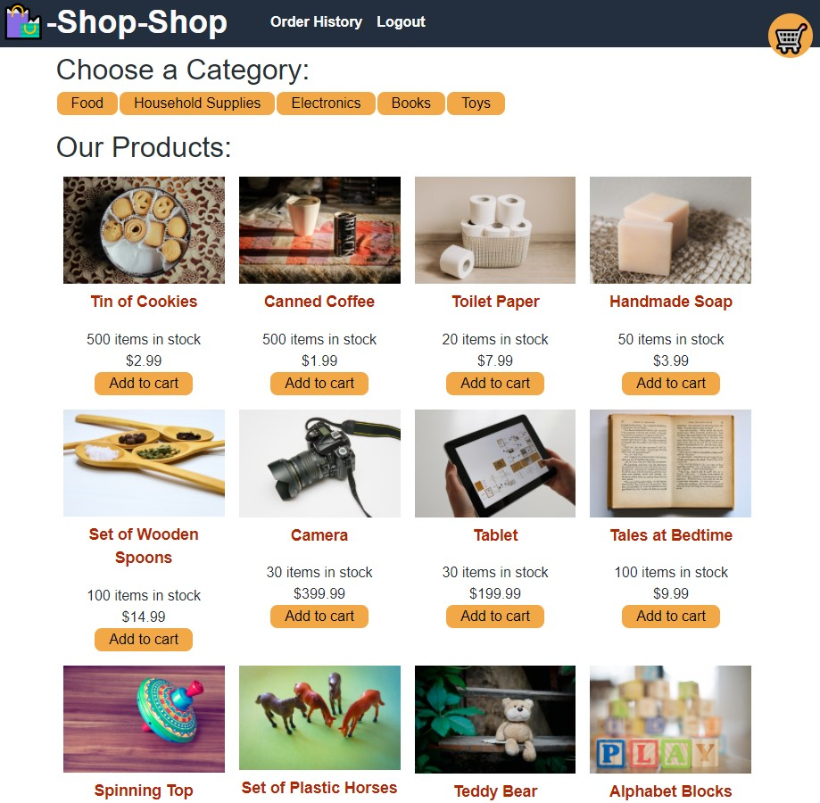

# Redux State Shop

## License

## Table of Contents

1. [Project Description](#project-description)
2. [Installation Instructions](#installation-instructions)
3. [Usage Information](#usage-information)
4. [Contributor Guidelines](#contributor-guidelines)
5. [Testing Instructions](#testing-instructions)
6. [License Info](#license-info)
7. [Questions](#questions)

## Visual Demonstration

## Visual Demonstration
* [Deployed Application](https://reduxstateshop.herokuapp.com/)

## Project Description

* A virtual shop using the redux state for product purchasing

## Installation Instructions

* None

## Usage Information

* None

## Contributor Guidelines

* [Submit bugs and feature requests](https://github.com/joshsands/redux-state-shop/issues).
* Review [source code changes](https://github.com/joshsands/redux-state-shop/pulls).

## Test Instructions

* None

## License Info

Copyright 2021
The source code for the site is licensed under the MIT license and can be found at the link below:
[License Info Link](https://opensource.org/licenses/MIT)
      

## Questions?

* Find me on Github at [Joshsands](http://github.com/Joshsands).
* E-mail me at josh.sands@mail.com.